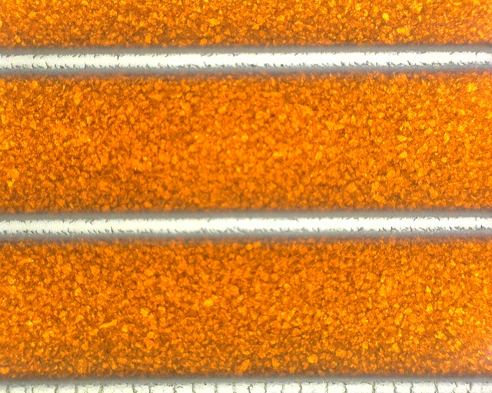
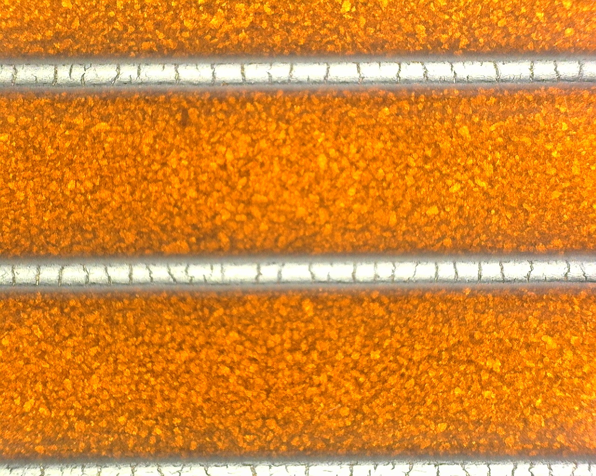
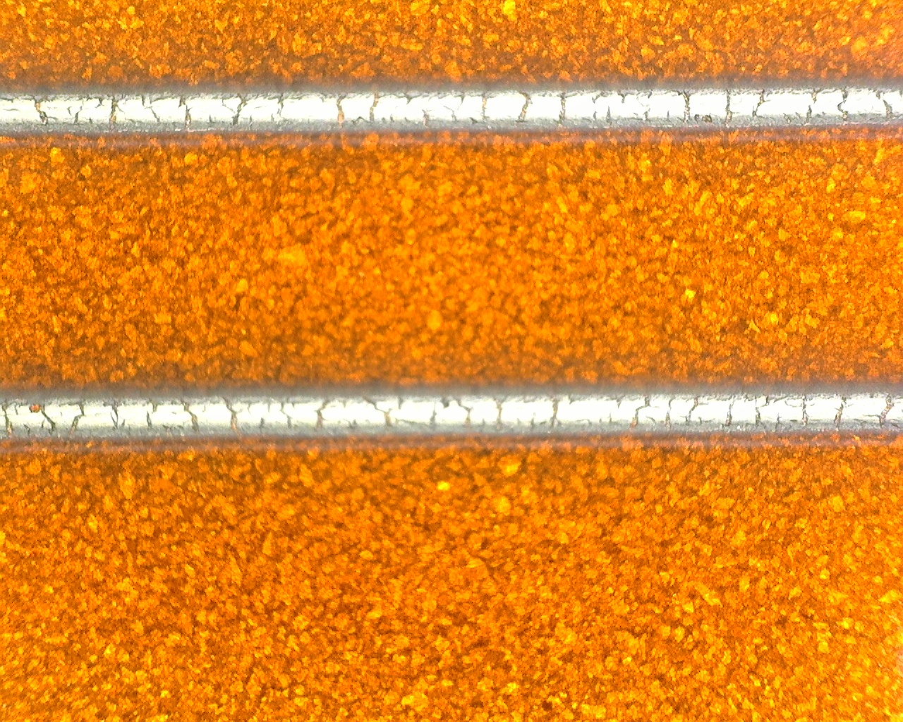

# im2quant

**Image-to-quantity prediction** — estimate a scalar material property
(e.g. electrical resistance here) of printed micro-structures directly from
optical microscope images, using a [YOLO](https://github.com/ultralytics/ultralytics)
backbone and a dual-head MLP.

Originally developed for laser-induced sintering of Platinum wire
lines ([experimental details](https://doi.org/10.1117/12.3084051)), but **fully general**: any material, any scalar target property, as long as you can provide microscope images and a measurement CSV.

---

## Example: Pt wire images across three resistance decades

| Batch 3 — ~2.5 Ω | Batch 2 — ~316 Ω | Batch 1 — ~847 Ω |
|:-----------------:|:----------------:|:----------------:|
|  |  |  |
| Low R, uniform wire | Moderate R | High R, interrupted wire |
| CoV = 0.08  | CoV = 0.20  | CoV = 0.45 |

The model predicts resistance from the image together with five process
parameters (print layers, power, speed, polish layers, polish power).
A second output head simultaneously classifies whether the wire measurement
is reliable (coefficient of variation CoV < 0.5).

---

## Installation

I recommend [uv](https://docs.astral.sh/uv/getting-started/installation/).
Install it, then run one command:

```bash
uv pip install git+https://github.com/Asraf235/im2quant.git
```

This installs im2quant and all dependencies automatically (torch, ultralytics,
optuna, scipy, scikit-learn, matplotlib, and more).


**GPU training** (recommended for the Optuna hyperparameter search): after the
above, reinstall PyTorch with your CUDA version from
[pytorch.org](https://pytorch.org/get-started/locally/).

---

## How to use it

### Step 1 — Prepare your data

**Images:** name them `batch{N}.{M}.jpg` — `N` = batch number, `M` = line
number (1–5). Put them all in one folder.

**CSV:** one row per batch with columns for each line's resistance
(`Line_1_R` … `Line_5_R`), the batch average (`Average_R`), standard
deviation (`StdDev_R`), coefficient of variation (`CoV_R`), and your process
parameters. See `examples/example_results.csv` for a ready-to-use template.

### Step 2 — Train

Open `scripts/train_example.py` in your editor and change the two paths at
the top to point to your image folder and CSV file: image_dir, csv_file, output_dir and then run it: 

```
python scripts/train_example.py
```

The script automatically tunes hyperparameters with Optuna, trains the final
model, and saves a checkpoint to `runs/my_material/`.

### Step 3 — Predict

Open `scripts/predict_example.py`, set the path to your image and fill in the
process parameters used for that print, then run:

```
python scripts/predict_example.py
```

The saved checkpoint file is self-contained — it stores everything needed to
make predictions on new images, including the parameter scaling factors learned
during training. You do not need the original images or CSV to predict on new data.

### Step 4 — Evaluate and plot

```
python scripts/evaluate.py       # prints R² and Factor-2 accuracy on the test set
python scripts/plot_results.py   # saves training_curve.png and r2_scatter.png
```

---

## Repository contents

```
im2quant/           Core Python package
scripts/            Ready-to-run training, evaluation, and prediction scripts
examples/           Three example images + minimal example CSV template
setup.py
requirements.txt
```

---

## Model architecture

```
Image  ──►  YOLO backbone (yolo26n)  ──►  feature vector [256]
                                                  │
                             + process parameters [5]
                                                  │
                                         Shared MLP neck
                                          ┌────┴────┐
                                          ▼         ▼
                                     Regression  Classifier
                                      log10(R)   Low/High CoV
```

**Loss** = 0.4 × regression MSE + 0.6 × classification cross-entropy

All hyperparameters (layer sizes, learning rate, dropout, loss weighting) are
tuned automatically by [Optuna](https://optuna.org/).

